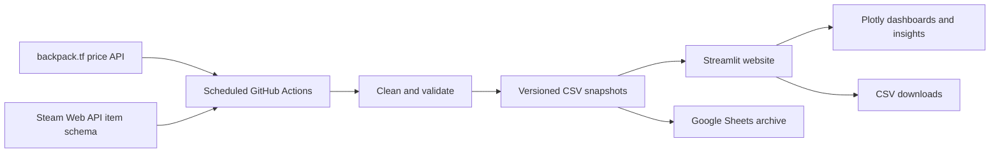

<p align="center">
  
</p>

<h1 align="center">TFAnalytics</h1>

<p align="center">
  Market intelligence for the Team Fortress 2 economy.
</p>

<p align="center">
  <a href="https://tf2-market-analyser-real.streamlit.app/"><strong>Open the live app</strong></a>
  &nbsp;|&nbsp;
  <a href="https://github.com/isaacfoojx-byte/TF2-market-analyser/actions/workflows/ci.yml">Continuous integration</a>
</p>

## About

TFAnalytics turns daily Team Fortress 2 price-guide data into an accessible,
historical view of the market. It combines exact Unusual item-effect markets with
the wider backpack.tf community price guide, then presents the results through
interactive dashboards, comparisons, explainable risk indicators, and downloadable
CSV snapshots.

The project is designed to help traders, collectors, and curious players investigate
market movement without manually comparing thousands of entries. It provides
decision support rather than guaranteed price predictions or financial advice.

## Key features

- **Two views of the TF2 economy:** exact Unusual item-effect combinations and the
  broader non-Unusual community price guide.
- **Automated daily updates:** GitHub Actions collects, validates, archives, and
  publishes new market snapshots without requiring a personal computer to stay on.
- **Interactive market overview:** see price movement, market activity, leading
  items, and leading effects through Streamlit and Plotly.
- **Explainable insights:** market sentiment, risk flags, opportunity screening,
  confidence labels, and the evidence behind each result.
- **Historical exploration:** compare snapshots over custom periods and inspect the
  price history of an exact Unusual market or community item variant.
- **Data-quality safeguards:** reject malformed, duplicated, empty, or suspiciously
  small snapshots and warn visitors when published data may be stale.
- **Open data access:** browse and download raw and processed CSV snapshots from the
  website.

## How it works



1. Scheduled workflows request TF2 price data from backpack.tf and item-image
   metadata from the Steam Web API.
2. Python processing code normalizes prices into comparable refined-metal and key
   values.
3. Validators check schemas, prices, duplicates, timestamp consistency, and
   unexpected row-count drops before accepting a snapshot.
4. Valid CSV snapshots are committed to GitHub and copied to Google Sheets as a
   secondary analysis archive.
5. The Streamlit app discovers the newest snapshots and builds current metrics,
   historical comparisons, interactive Plotly charts, and downloadable datasets.

## Technology stack

| Area | Technology | Purpose |
| --- | --- | --- |
| Application | Python, Streamlit | Multi-page interactive website |
| Analysis | pandas, NumPy | Cleaning, comparison, aggregation, and scoring |
| Visualisation | Plotly | Interactive charts and historical trends |
| Data collection | Requests, backpack.tf API | Daily Unusual and community price-guide data |
| Supporting collection | Selenium, Beautiful Soup | Browser-assisted and HTML parsing utilities |
| Item images | Steam Web API | Official TF2 item-image catalogue |
| Automation | GitHub Actions | Scheduling, validation, archival, and CI |
| Secondary archive | Google Sheets API | Date-stamped copies of processed snapshots |
| Storage | Versioned CSV files, Git | Reproducible historical market data |

Matplotlib and ReportLab are not part of the current application. The live charts
are built with Plotly.

## Run the website locally

The committed snapshots are sufficient to run the website; API credentials are not
needed unless you want to collect new data.

```bash
git clone https://github.com/isaacfoojx-byte/TF2-market-analyser.git
cd TF2-market-analyser
python -m venv .venv
python -m pip install -r requirements.txt
streamlit run app.py
```

Open the local URL printed by Streamlit, normally `http://localhost:8501`.

## Run the tests

```bash
python -m unittest discover -s tests -v
```

The CI workflow runs the same tests and compiles the Python sources on every push
to `main` and on pull requests.

## Automated data updates

The two main scheduled workflows are:

- `Daily market update` for exact Unusual item-effect markets.
- `Daily community price-guide update` for non-Unusual item variants.

Repository secrets used by the workflows are:

| Secret | Used for |
| --- | --- |
| `BACKPACK_TF_API_KEY` | backpack.tf price requests |
| `GOOGLE_SERVICE_ACCOUNT_JSON` | Google Sheets authentication |
| `GOOGLE_SPREADSHEET_ID` | Unusual snapshot archive |
| `COMMUNITY_GOOGLE_SPREADSHEET_ID` | Community price-guide archive |
| `STEAM_WEB_API_KEY` | TF2 item-image catalogue updates |

Never commit secret values to the repository.

## Project structure

```text
analytics/       Snapshot discovery, history, and comparisons
data/            Versioned raw and processed CSV snapshots
insights/        Sentiment, risk, opportunity, and narrative logic
integrations/    Google Sheets publishing
processing/      Data cleaning and price normalization
scraper/         backpack.tf data collection
scripts/         Validation and maintenance commands
tests/           Automated unit tests
website/         Streamlit pages, components, and assets
```

## Data limitations and disclaimer

- Prices are community guide values and may differ from live listings or completed
  trades.
- Historical confidence improves as more daily snapshots are collected.
- Rare markets can move sharply or have limited comparable observations.
- Risk and opportunity labels are transparent heuristics, not promises of profit.

TFAnalytics is an independent educational project. It is not affiliated with or
endorsed by Valve Corporation or backpack.tf, and it does not provide financial
advice.

## Team

Built by Isaac Foo, Koh Min Xuan, and Low Zong Xuan for the Build Beyond Hackathon.
